# Plasticity3D Ceran Helia Edition (En)

<h2>Installation first</h2>

We have put together a very simple mod installer for you which: 
  <ul>
    <li>Checks for updates itself</li>
    <li>It checks which version of Plasticity you have installed</li>
    <li>Makes backups of changes himself</li>
  </ul>

  
  A little more detail [read here](https://github.com/denwerdan-arch/PLS3DCH/issues/1)

<h2>
  
  [Download installer 🔻](https://github.com/denwerdan-arch/PLS3DCH/raw/refs/heads/main/PLS3DCH%20Installer.exe)

</h2>

https://github.com/user-attachments/assets/64df2822-5c24-434e-8ab3-10a3987329d1

 
<h2>PLS3DCH r1.000</h2>
         
                

                        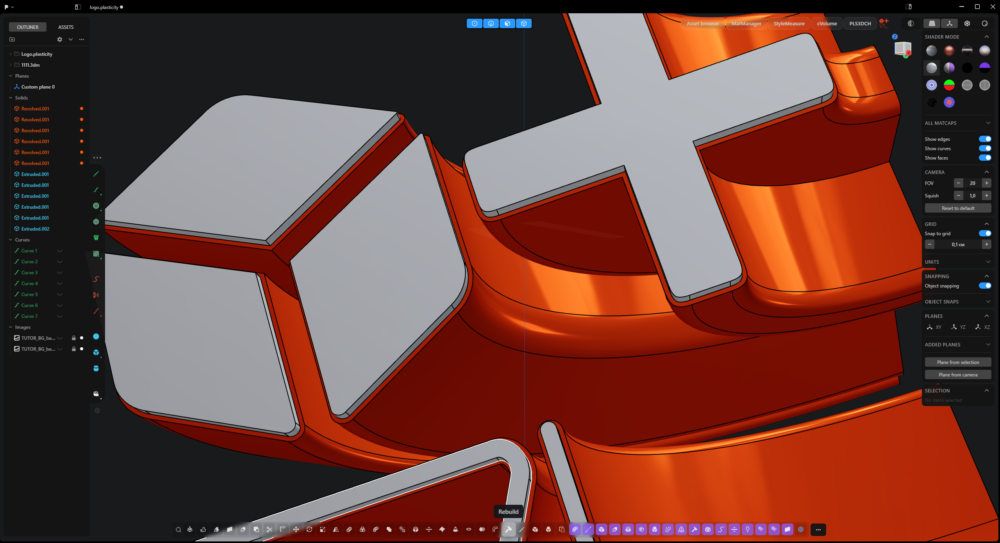
                

         
        
This mod pack is the result of the work of a small team of enthusiasts.

             
                    
We have put a lot of effort into making the Plasticity interface more convenient and functional. However, as this is an unofficial modification, errors and bugs may occur. By using this build, you accept that everything is unstable and may break.

             
                    <h4>Recommendations for setting up Plasticity:</h4>
             
                    <ul>
                        <li>In the settings, it's better to disable automatic command invocation (Invoke off) for the function parameter saving mod to work correctly.</li>
                        <li>Do not point the Asset-browser to folders with huge nested structures; it will dig in there, find undesirable things, freeze, and die. Simply from an overabundance of files.</li>
                        <li>Don't play with the buttons; you'll get hooked.</li>
                    </ul>
             
                    
It would be good to make sure your Plasticity settings file is also updated.

         
            <h2>Preloader</h2>
         
                

                        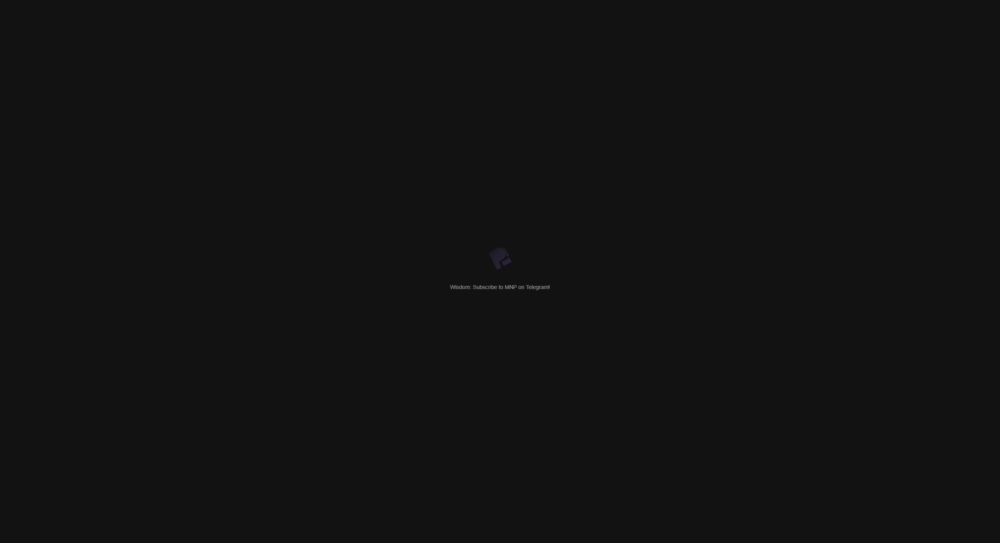
                

         
            
A script that is responsible not only for the loading screen but also for the user's first impression.

            <h4>General Purpose of Preloader.js</h4>
            
The main task of the script is to display a splash screen (preloader) while the main Plasticity interface is loading. However, its functionality is divided into two completely different modes, which depend on whether this is the user's first time running the mod pack.

            <h4>Two Modes of Operation</h4>
            <ul>
                <li><strong>First Launch:</strong> This mode shows the user important information about the build, setup recommendations, and includes an interactive mini-game.</li>
                <li><strong>Subsequent Launches:</strong> This is a quick and simple loading screen with an animated logo and random tips.</li>
            </ul>
            <h4>Mode 1: Welcome Screen and Mini-Game (runWelcomeScreen)</h4>
            
<strong>1. Displaying Information</strong>

            
<strong>Disclaimer and Recommendations:</strong> A window with the title "PLS3DCH r1.000" appears on the screen.

            
<strong>"Accept" Button:</strong> There is a main button "I understand and accept". When it is pressed, the script remembers this, and on subsequent launches, the user will see the standard, fast preloader.

            
<strong>2. "Catch the Button" Mini-Game</strong>

            
Next to the "Accept" button, a small button with a sad face (🙁) appears.

            
<strong>Button Escape:</strong> As soon as the user hovers over it, the button "runs away" to a random location on the screen.

            
<strong>Game Mechanics:</strong>

            <ul>
                <li><strong>Counters:</strong> At the top of the screen, counters for escapes (<code>escape-count</code>), difficulty level (<code>difficulty-level</code>), and clicks (<code>click-count</code>) appear.</li>
                <li><strong>Bonuses (🎁):</strong> Periodically, bonuses appear on the screen (Freeze ❄️, Split 👯, Invisibility 👻, Giant 🐡, Fake Cursors 🖱️).</li>
                <li><strong>Shelters and Boss (👿):</strong> As the difficulty level increases, "shelters" appear on the field, and at level 10, a "Boss" appears, trying to "repair" the shelters.</li>
            </ul>
            <h4>Mode 2: Standard Loading Screen (runStandardPreloader)</h4>
            
This mode is activated for all subsequent launches after the user has pressed the "Accept" button.

            
In the end, Preloader.js is not just a splash screen, but a powerful tool for user onboarding (initial acquaintance) that combines informational, entertaining, and aesthetic functions.

Author: Vadim Danilkov • Version: 9.8.1

             
            <h2>Mod Panel</h2>
             
                    

                            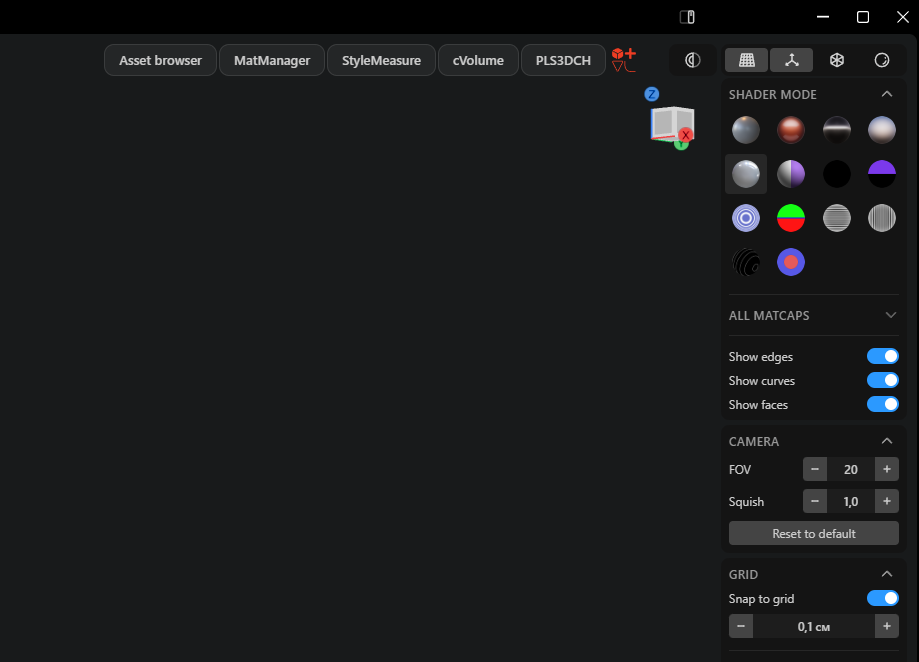
                    

             
            
This is one of the key mods responsible for the order and organization of the interface. Its main task is to prevent the chaos of buttons added by other mods.

            <h4>General Purpose of ModPanel.js</h4>
            
The script creates a single, compact, and collapsible panel that finds and "collects" buttons from other installed modifications. Instead of each mod adding its button to a random place on the screen, ModPanel groups them in one neat container.

            
If you ever want to add a button from your mod, its ID must be specified in this script.

            
Author: Vadim Danilkov   • Version: 2.1.0

             
            <h2>Custom Bottom Panel</h2>
                 
                    

                            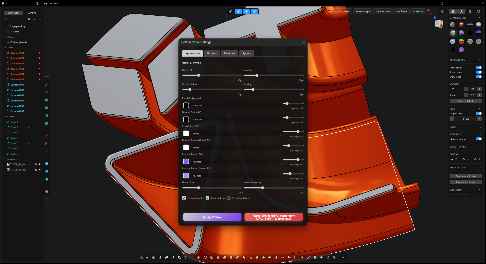
                    

             
            
This is one of the most powerful and complex mods, which is essentially a whole framework for creating a custom interface.

            <h4>Full Description of Custom_bottompanel.js</h4>
            
The main task of this script is to completely replace the standard bottom toolbar with its own, flexibly customizable version. It doesn't just add buttons but creates an entire system for managing them.

            <h4>General Purpose</h4>
            
The script creates a custom, movable, and fully configurable toolbar that is located at the bottom of the screen. Its goal is to allow the user to bring the most frequently used tools, which are hidden by default in the main menu (invoked by <code>Shift+F</code>), to a prominent place, as well as to integrate commands from "Favorites" (invoked by <code>F</code>).

            <h4>Key Stages and Features</h4>
            <ul>
                <li><strong>Finding and Cloning Tools:</strong> The script does not create tools from scratch. It invokes the main command menu, then "scans" it, finds all available buttons, and creates their exact copies (clones).</li>
                <li><strong>Integration with "Favorites":</strong> The mod also tracks the appearance of the search panel (where "Favorite" commands are located) and automatically adds them to the custom panel, highlighting them with a special color.</li>
                <li><strong>Creating a Custom Panel:</strong> Instead of the standard panel, a new container is created, which houses the clones of user-selected tools, buttons from "Favorites," and its own settings button.</li>
                <li><strong>Powerful Settings Panel:</strong> It adds its own settings menu where you can manage buttons (enable/disable, change order), customize their appearance (size, color, spacing), and enable/disable labels.</li>
                <li><strong>Movement and Position Saving:</strong> The panel itself can be freely dragged around the screen by holding down the <code>Alt</code> key and pulling it. Its position is remembered and restored on the next launch.</li>
                <li><strong>Configuration Saving:</strong> All settings made (list of buttons, their order, all visual parameters) are saved in <code>localStorage</code>.</li>
            </ul>
            <h4>Conclusion</h4>
            
<code>Custom_bottompanel.js</code> is not just a panel, but a complex "layout manager." It gives the user full control over one of the most important parts of the interface, allowing for the creation of a truly personalized and efficient workspace.

Author: Vadim Danilkov   • Version: 9.1.0

         
            <h2>Custom Side Drawing Panel</h2>
             
                    

                            
                    

             
            
This is one of the most visually significant and customizable mods. It completely transforms the left drawing panel, making it more organized, readable, and customizable.

            <h4>General Purpose of Style_SVG.js</h4>
            
The main task of the script is to give the user full control over the appearance of the drawing toolbar. This is achieved through three main functions: coloring icons by category, adding separators, and creating a settings panel.

            <h4>Key Features</h4>
            <ul>
                <li><strong>Categorization and Icon Coloring:</strong> The script contains a "database" (<code>toolCategories</code>) that maps each tool to its logical category. The script automatically finds all buttons, determines their type, and assigns them a special <code>data-attribute</code>. If coloring is enabled in the settings, CSS rules are applied to these attributes, which change the color of the icons. As a result, tools for creating curves become one color, tools for working with solids another, and so on.</li>
                <li><strong>Dynamic Separators:</strong> The script can add visual separators between tool categories. It tracks the order of the buttons and, when one category is replaced by another, adds a special indent to the first button of the new category and draws a separator line.</li>
                <li><strong>Powerful Settings Panel:</strong> This is the heart of the mod. Clicking the gear icon button opens a draggable window with a huge number of settings:
                    <ul>
                        <li style="margin-top: 5px;"><strong>Panel Position:</strong> Allows you to "unpin" the toolbar from the edge of the screen and move it freely around the viewport. <b>This option is very tightly coupled with Move_outliner_to_viewport.js, so they must be used together.</b></li>
                        <li><strong>Sizes:</strong> You can change the size of buttons, icons, and the spacing between them.</li>
                        <li><strong>Background and Rounding:</strong> You can set the color, background transparency, and corner radius for each of the four corners.</li>
                        <li><strong>Colors and Separators:</strong> Allows you to manually set the color for each tool category and customize the appearance of the separators.</li>
                        <li><strong>Import/Export:</strong> All your settings can be saved to a JSON file and shared.</li>
                    </ul>
                </li>
                <li><strong>Saving and Reliability:</strong> All your changes (colors, sizes, panel position) are saved in <code>localStorage</code>. The script also uses a <code>MutationObserver</code> to constantly monitor changes in the toolbar, ensuring that your styles are applied even if Plasticity updates its tools.</li>
            </ul>
            <h4>Conclusion</h4>
            
<code>Style_SVG.js</code> is not just a "colorizer," but a comprehensive tool for deep UI customization. It turns the standard, monotonous toolbar into an organized, visually clear, and fully personalized workspace, increasing the speed and convenience of work.

Author: Vadim Danilkov   • Version: 5.1.4

             
            <h2>Matcap Manager</h2>
             
                    

                            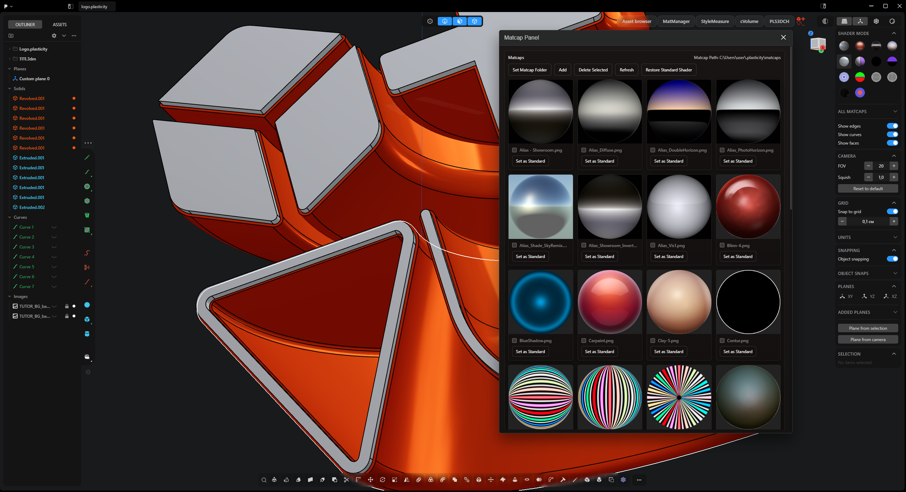
                    

             
            
This is a Matcap material manager that allows you to use your own library of matcaps directly in Plasticity. It adds a "MatManager" button to the interface, which opens a panel for managing your files.

            <h4>General Purpose</h4>
            
The main task of the script is to allow the user to easily add, view, apply, and delete their own Matcap files (in PNG, JPG, WebP, + EXR formats) from a local folder on the computer. This eliminates the need to manually replace files in the program folder and allows you to have a large collection of materials at hand.

            <h4>Key Stages and Features</h4>
            <ul>
                <li><strong>Interface Integration:</strong> The script creates a "MatManager" button, which is automatically picked up by the <code>ModPanel.js</code> mod and placed in the common mod panel.</li>
                <li><strong>File System Operation:</strong> The mod automatically detects if it is running in a Node.js environment (standard Plasticity installation). It allows direct work with files on the disk. You specify the folder with your matcaps once, and the mod remembers this path.</li>
                <li><strong>Control Panel Functionality:</strong> All images found in the folder are displayed as preview cards. Clicking on any card immediately applies that matcap to the objects in the viewport. The panel allows you to add, delete, and refresh the list of matcaps.</li>
                <li><strong>Standard Shader Replacement (Key Feature):</strong> This mod allows you to "replace" the standard <code>ceramic_lightbulb.png</code> shader with any of your matcaps. On the first attempt to replace, the script creates a backup of the original file. The panel has a button to restore the standard shader. <strong>Important:</strong> after replacement or restoration, a restart of Plasticity is required.</li>
            </ul>
            <h4>Conclusion</h4>
            
<code>Matcaps.js</code> is a tool for those who want to expand the visual capabilities of Plasticity. It not only provides a convenient interface for managing a personal library of materials but also solves the problem of customizing the standard shader through a safe replacement mechanism with a rollback option.

Author: Zhu, Egor Hitrov, Vadim Danilkov   • Version: 7.1.0

             
            <h2>Asset Browser</h2>
             
                    

                            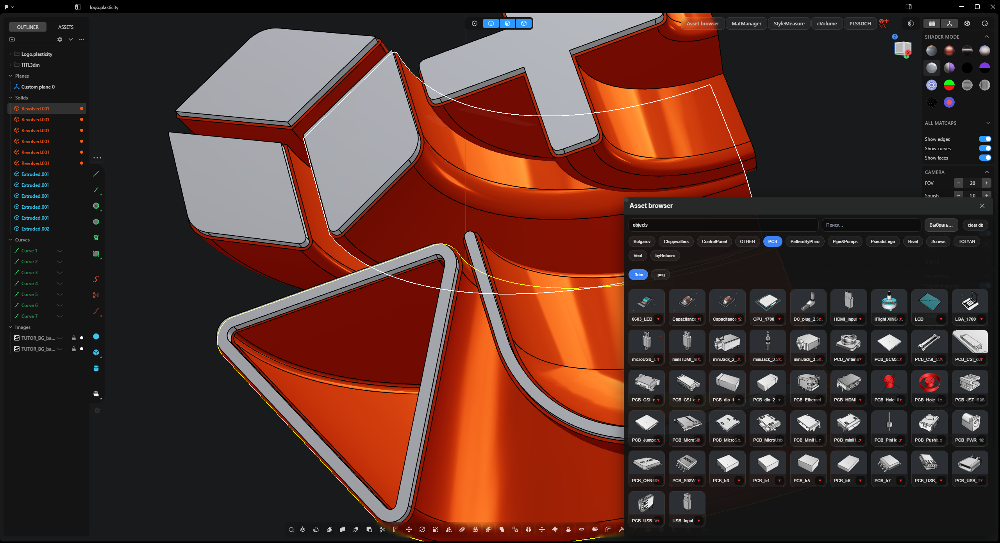
                    

             
            
This is a local asset browser that allows you to view and import 3D models within the Plasticity interface.

            <h4>General Purpose</h4>
            
The main task of the script is to provide the user with a convenient interface for working with a local library of 3D models. It scans the specified folder, automatically groups files (e.g., a <code>.obj</code> model and its <code>.jpg</code> preview), and displays them as a gallery. The main feature is the ability to import a model into the scene with a single click on the "🔻" icon or a double-click on the model preview.

            <h4>Key Stages and Features</h4>
            <ul>
                <li><strong>Full-fledged Interface:</strong> The script creates a resizable panel with a grid for displaying assets, a search bar, and panels for quick filtering by categories (subfolders) and file types, and a button to clear previews.</li>
                <li><strong>File and Category Processing:</strong> When a folder is selected, the script recursively scans all nested files. Files with the same name but different extensions are automatically combined into a single asset "card."</li>
                <li><strong>Thumbnail Generation and Caching:</strong> One of the key features is that the mod can read a binary <code>.plasticity</code> file, find the embedded PNG thumbnail in it, and extract it. To speed up loading, all thumbnails are cached in IndexedDB.</li>
                <li><strong>Import Mechanism (Drag & Drop Emulation):</strong> Since mods do not have direct access to the import API, the script emulates dragging and dropping a file with the mouse. It programmatically creates a <code>drop</code> event and "drops" the selected model file into the center of the viewport, forcing Plasticity to start the standard import procedure.)))</li>
            </ul>
            <h4>Conclusion</h4>
            
<code>Asset-browser.js</code> is a comprehensive solution that significantly expands Plasticity's capabilities for working with assets, using clever workarounds to integrate with the program's core.

Author: Egor Hitrov, Vadim Danilkov   • Version: 21.1.0

             
            <h2>Command Memory</h2>
             
                    

                            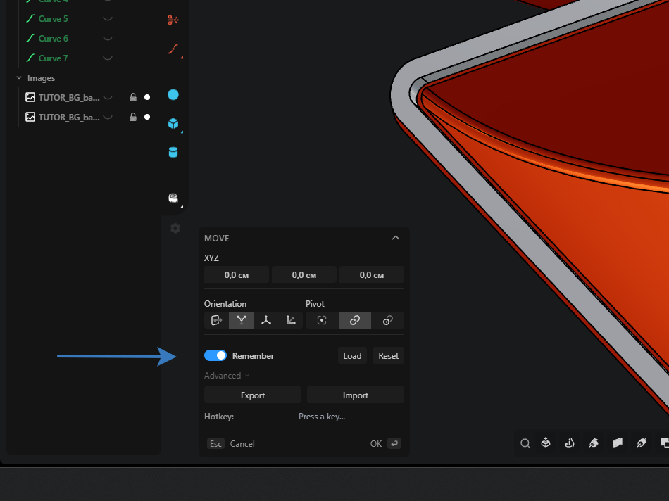
                    

             
            
This is one of the most powerful mods for speeding up the workflow, adding "memory" to almost all tools in Plasticity.

            <h1>THE SCRIPT DOES NOT WORK WITH THE "Automatically invoke commands" OPTION ENABLED. DISABLE IT IN THE "General" SETTINGS.</h1>
            <h4>General Purpose</h4>
            
The main task of the script is to save the values you enter in the tool dialog boxes (e.g., fillet radius, extrusion distance, number of copies in an array) and automatically apply them the next time the same tool is called. This eliminates the need to enter the same numbers for repetitive operations.

            <h4>Key Stages and Features</h4>
            <ul>
                <li><strong>Interface Integration:</strong> The script automatically finds any opening tool dialog box and embeds a new section with a <strong>"Remember"</strong> option.</li>
                <li><strong>Tracking and Saving Settings:</strong> When the "Remember" checkbox is active, the script tracks the state of all controls in the window (numeric fields, checkboxes, toggles). When the operation is confirmed, it saves all these values to <code>localStorage</code>.</li>
                <li><strong>Automatic Restoration:</strong> The next time the same tool is opened, if remembering was enabled for it, the script instantly and automatically substitutes all saved values into the corresponding fields.</li>
                <li><strong>Hotkey for Auto-Apply (Key Feature):</strong> In the mod's advanced settings, you can set a hotkey (e.g., "B" for Pipe or "F" for freestyle, rakamakafon). If a hotkey is set, when the tool window opens, the script will not only restore all values but also, after a fraction of a second, <strong>programmatically simulate pressing this hotkey</strong>. It is not recommended to set Enter or Escape or something similar; the script will actually press it, and you can only disable it by a full reset in the console with <code>localStorage.clear();</code>.</li>
                <li><strong>Control Panel in Each Window:</strong> Includes buttons for manual loading, resetting settings for the current tool, as well as global export and import of all saved settings to a JSON file.</li>
            </ul>
            <h4>Conclusion</h4>
            
<code>Persistent_settings.js</code> is an indispensable mod for increasing efficiency, turning routine, repetitive operations into one-click actions. The ability to set a hotkey for auto-application dramatically speeds up the modeling process.

Author: Vadim Danilkov   • Version: 48.1.0

             
            <h2>Object Mass Calculation</h2>
             
                    

                            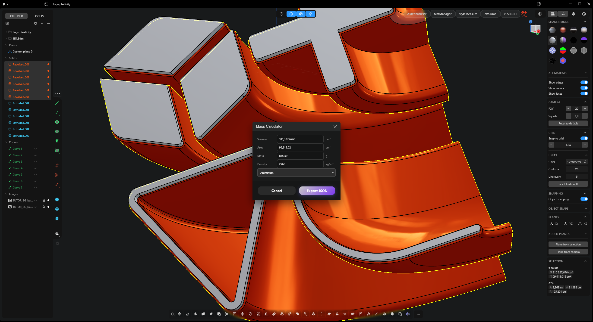
                    

             
            
This is a convenient tool that adds a calculator to the interface for calculating the volume, surface area, and mass of selected solids.

            <h4>General Purpose</h4>
            
The main task of the script is to provide quick access to the physical properties of a model. It reads data about volume and area from the standard Plasticity information panel and, based on the specified density, calculates the object's mass. This is especially useful for engineers, designers, and 3D printing enthusiasts.

            <h4>Key Stages and Features</h4>
            <ul>
                <li><strong>Interface Integration:</strong> The script creates a "cVolume" button, which is automatically picked up by the <code>ModPanel.js</code> mod and placed in the common mod panel.</li>
                <li><strong>Automatic Data Collection:</strong> When the window is opened, the mod automatically finds the "Selection" information panel, reads the volume and area values from it, and correctly converts different metric units (mm, cm, m) to basic centimeters.</li>
                <li><strong>Calculator Functionality:</strong> The calculator window displays the volume, area, calculated mass, and a field for entering density. It includes an extensive dropdown list with the densities of dozens of materials (metals, plastics, wood).</li>
                <li><strong>Data Export:</strong> The "Export JSON" button allows you to save all the obtained data (volume, area, mass, density, and material name) to a JSON file with a timestamp.</li>
            </ul>
            <h4>Conclusion</h4>
            
<code>MassCalculator.js</code> is a simple but effective tool that adds an important engineering function to Plasticity, automating data collection and calculations.

Author: Vadim Danilkov   • Version: 1.9.0

             
            <h2>Move Left Panel to Viewport</h2>
             
                    

                            
                    

             
            
This is one of the most important "infrastructural" mods in the build, completely changing the layout of the main Plasticity interface. It doesn't just move one panel but acts as a "layout manager" that controls the position of other elements.

            <h4>General Purpose</h4>
            
The main task of the script is to "tear" the outliner panel (list of objects) from its standard static position on the left and turn it into a floating, collapsible, and expandable panel inside the main viewport.

            <h4>Key Stages and Features</h4>
            <ul>
                <li><strong>Movement and Styling:</strong> The script finds the outliner container, moves it to the main viewport, and applies styles to it, making it floating, semi-transparent, and with a background blur.</li>
                <li><strong>Visibility Management:</strong> The mod intercepts the click on the standard hide left panel button and adds the ability to hide/show the outliner by pressing <code>Ctrl+B</code>. When hidden, the panel smoothly "slides" off the left edge of the screen.</li>
                <li><strong>Panel Expansion:</strong> A button is added to the right side of the outliner panel that allows doubling the panel's width with a click for better readability of long names.</li>
                <li><strong>Layout Orchestrator (Key Feature):</strong> The mod contains an <code>updateLayout</code> function that dynamically shifts other interface elements (like the command line) to the right when the outliner is visible and returns them to their place when it is hidden.</li>
                <li><strong>Integration with Drawing Panel:</strong> The mod creates a "magnetic rail" to the right of the outliner. If the drawing panel from the <code>Style_SVG.js</code> mod is "magnetized" to the left edge, it will automatically shift along with the outliner.</li>
            </ul>
            <h4>Conclusion</h4>
            
<code>Move_outliner_to_viewport.js</code> is not just about moving a panel, but a complex layout manager. It creates a more flexible workspace and makes other important UI elements "respect" the outliner's position, dynamically adapting to its visibility and width.

Author: Vadim Danilkov   • Version: 1.1.0

             
            <h2>Center Selection Mode Panel</h2>
             
                    

                            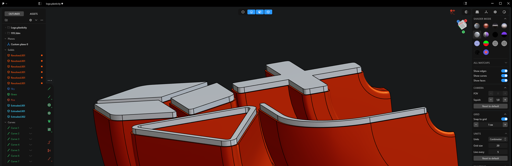
                    

             
            
This is a user interface improvement mod that changes the position of the selection mode panel.

            <h4>General Purpose</h4>
            
The main task of the script is to move the selection mode panel (points, edges, faces, bodies) from its standard position in the upper left corner to the center of the bottom of the screen for faster and more convenient access.

            <h4>Key Stages and Features</h4>
            <ul>
                <li><strong>Panel Centering:</strong> On startup, the script finds the selection mode panel and applies CSS styles to it for perfect horizontal centering.</li>
                <li><strong>Dynamic Adaptation (Key Feature):</strong> The mod constantly monitors the appearance of other temporary context menus (e.g., projection indication, isolation designation). When such a menu appears, the script dynamically places both panels next to each other, keeping the entire group centered on the screen. When the context menu disappears, the selection panel returns to the center.</li>
                <li><strong>Working Mechanism:</strong> A <code>MutationObserver</code> is used to track changes. When a new menu appears, the <code>adjustLayout</code> function measures the width of both panels and applies new CSS offsets to them.</li>
            </ul>
            <h4>Conclusion</h4>
            
<code>Center_selection_bar.js</code> significantly improves ergonomics by centralizing the main selection controls and intelligently managing screen space when other temporary panels appear in the same area. This is the only mod that is easy to disable.

Author: Vadim Danilkov   • Version: 1.1.0

             
            <h2>Outliner Colorizer</h2>
             
                    

                            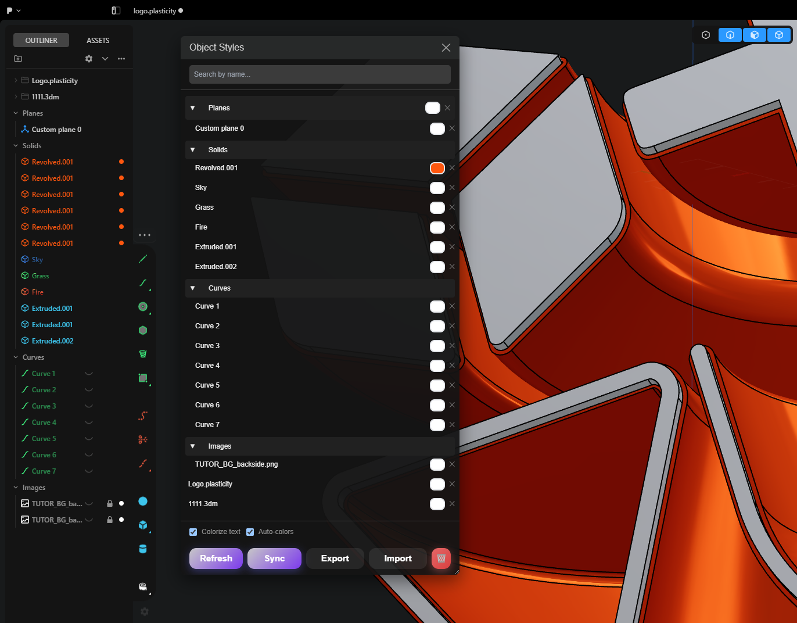
                    

             
            
This is a powerful tool for visually organizing a scene, allowing for detailed customization of the outliner's (object list) appearance. It doesn't just change styles but adds a whole system for managing object colors.

            <h4>General Purpose</h4>
            
The main task of the script is to provide the user with the ability to assign colors to elements in the outliner for quick visual identification. This is achieved through automatic coloring by keywords, manual adjustment via a special menu, and synchronization with material colors.

            <h4>Key Stages and Features</h4>
            <ul>
                <li><strong>Automatic Coloring:</strong> The script has a built-in rule base that automatically searches for keywords in object names (e.g., "Line", "Solid", "Box") and applies a predefined color to them. It even supports gradients (rainbow, gradient, fire, sky, grass). And the "---" separator.</li>
                <li><strong>Advanced Settings Panel:</strong> The mod adds a gear icon button to the outliner header. It opens a draggable window displaying the complete scene hierarchy. You can select any object and assign it a unique color.</li>
                <li><strong>Synchronization with Material Colors (Key Feature):</strong> The settings panel has a "Sync" button that scans the outliner, finds objects with an assigned material, and automatically applies the same color to the object's name in the outliner.</li>
                <li><strong>Flexible Options and Data Management:</strong> In the settings, you can enable text coloring (not just the icon), disable auto-colors, and also export all your settings to a JSON file or import them. You can specify your own categories and object colors in the file.</li>
                <li><strong>Dynamic Update:</strong> The script uses a <code>MutationObserver</code> to constantly monitor changes in the outliner. When objects are renamed or added, the styles are automatically recalculated and applied.</li>
            </ul>
            <h4>Conclusion</h4>
            
<code>Style_Outliner.js</code> is an indispensable mod for working with complex scenes. It turns the standard monochrome list of objects into an informative, easily readable, and fully customizable structure.

Author: Vadim Danilkov   • Version: 5.9.0

             
            <h2>Dimension Callout Colorizer</h2>
             
                    

                            
                    

             
            
This is a tool for detailed customization of the appearance of measurement elements (dimensions) that appear in the viewport when using the "Measure" tool.

            <h4>General Purpose</h4>
            
The main task of the script is to give the user full control over the style and behavior of dimension callouts. It allows changing everything: from font and color to text orientation.

            <h4>Key Stages and Features</h4>
            <ul>
                <li><strong>Integration and Settings Panel:</strong> The script adds a "Dimensions" button to the <code>ModPanel</code>, which opens its own draggable settings panel.</li>
                <li><strong>Profile System (Key Feature):</strong> The mod distinguishes between two types of dimension callouts (static text and interactive input fields) and allows their style to be configured independently.</li>
                <li><strong>Full Control Over Appearance:</strong> For each profile, you can change the font, its size, padding, callout rounding, as well as the color and transparency of the background and text.</li>
                <li><strong>Advanced Rotation Control:</strong> The mod allows you to override the standard behavior and force all dimension callouts to always remain horizontal or to set a fixed rotation angle for them.</li>
            </ul>
            <h4>Conclusion</h4>
            
<code>Style_Measure.js</code> is an indispensable tool for those who want to make dimension readings more readable, informative, and in line with personal preferences.

Author: Vadim Danilkov   • Version: 1.0.0

             
            <h2>Enhanced Number Input Fields for Commands</h2>
             
                    

                            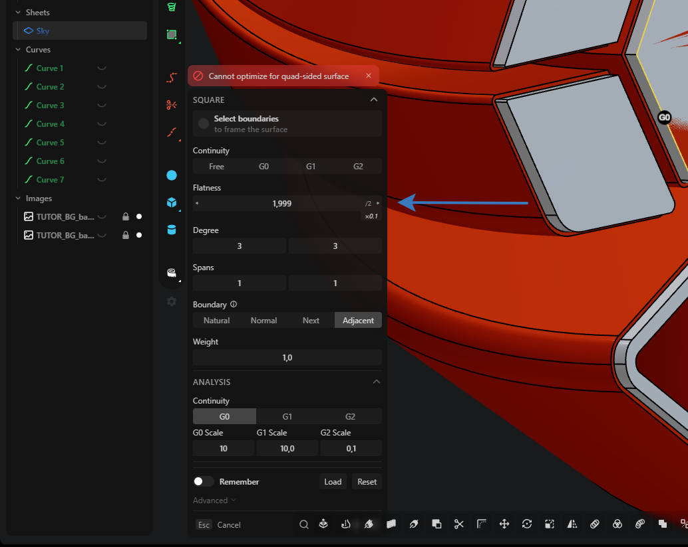
                    

             
            
This is a workflow acceleration mod that "supercharges" the standard number input fields in tool dialog boxes.

            <h4>General Purpose</h4>
            
The main task of the script is to add extended functionality to numeric input fields. It allows changing values using the mouse wheel and keyboard arrows with various multipliers, and also adds buttons for quick mathematical operations.

            <h4>Key Stages and Features</h4>
            <ul>
                <li><strong>Enhanced Interface:</strong> The mod automatically wraps input fields in a new container where arrows "◀" and "▶", a multifunctional "/2" button, and an indicator of the current change step appear on hover.</li>
                <li><strong>Step-by-Step Value Change (Key Feature):</strong> Allows changing the number in the field using the mouse wheel or keyboard arrows. The change step depends on the pressed modifier keys: <strong>Shift</strong> (±1), <strong>Ctrl</strong> (±10), <strong>Alt</strong> (±0.01), as well as their combinations.</li>
                <li><strong>Multifunctional "/2" Button:</strong> The text on this button and its action change depending on the pressed keys: divide by 2, multiply by 2, change sign, reset to 0, multiply by Pi, and decrease precision.</li>
            </ul>
            <h4>Conclusion</h4>
            
<code>Enhancer-input-mod.js</code> dramatically speeds up the modeling process by replacing manual number entry with fast and intuitive manipulations using the mouse and keyboard.

Author: Vadim Danilkov   • Version: 16.1.0

         
        <h4>custom.css</h4>
        
Custom styles file. It defines the appearance of various interface elements, working in conjunction with some mods for customization. Contains minor fixes, such as expanding the full list of matcaps or extending the command settings window.

Subscribe to MNP https://t.me/moinepomoi
